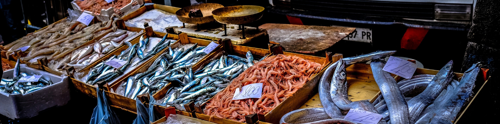

Seafood is crucial for global food security, providing 20% of animal protein and supplies essential fatty acids and micronutrients. As one of the most highly-traded foods, the sector is rapidly evolving with aquaculture growth, trade shifts, and increasing commoditization. Our open-science research group fuses global trade, local consumption, and environmental impact data to explore the opportunities and risks of seafood globalization for sustainable production and food security. 
